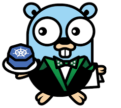
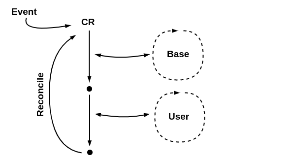

<h1 align="center">jenkins operator</h1>

### Overview
The Jenkins Operator is a Kubernetes Native Operator which manages operations for Jenkins on Kubernetes. It has been built with Immutability and declarative Configuration as Code in mind. The Jenkins Operator is easy to install with just a few manifest and allows users to configure and manage Jenkins on Kubernetes.

Out of the box it provides:

- Integration with Kubernetes
- Pipelines as Code
- Extensibility via Groovy Scripts
- Secure Defaults and Hardening

**jenkins-operator:**

With the standard Jenkins deployment we face lot of problems . We want to make Jenkins more robust, suitable for dynamic and multi-tenant environments where Jenkins Operator helps.

Below are problems which will get solved with Jenkins Operator

- Installing plugins with incompatible versions or security vulnerabilities
- Better configuration as code
- Security and hardening out of the box
- Make errors more visible for end users
- Backup and restore for jobs history
- Orphaned jobs with no JNLP connection
- Handle graceful shutdown properly
- Proper end to end tests for Jenkins lifecycle

**Architecture and design:**
Jenkins Operator fundamentals

The Jenkins Operator design incorporates the following concepts:

- Watches any changes of manifests and maintain the desired state according to deployed custom resource manifest
- Implements the main reconciliation loop which consists of two smaller reconciliation loops - base and user

### Objective of tutorial

In this tutorial,we are going to cover following topics:

1. Install Jenkins Operator and verify its successful installation.
2. Create Jenkins Instance and verify status of pods and services.
3. Manually Update Plugins.
4. Access Jenkins Dashboard and create Jenkins Pipeline.
5. Cleanup Operator.
